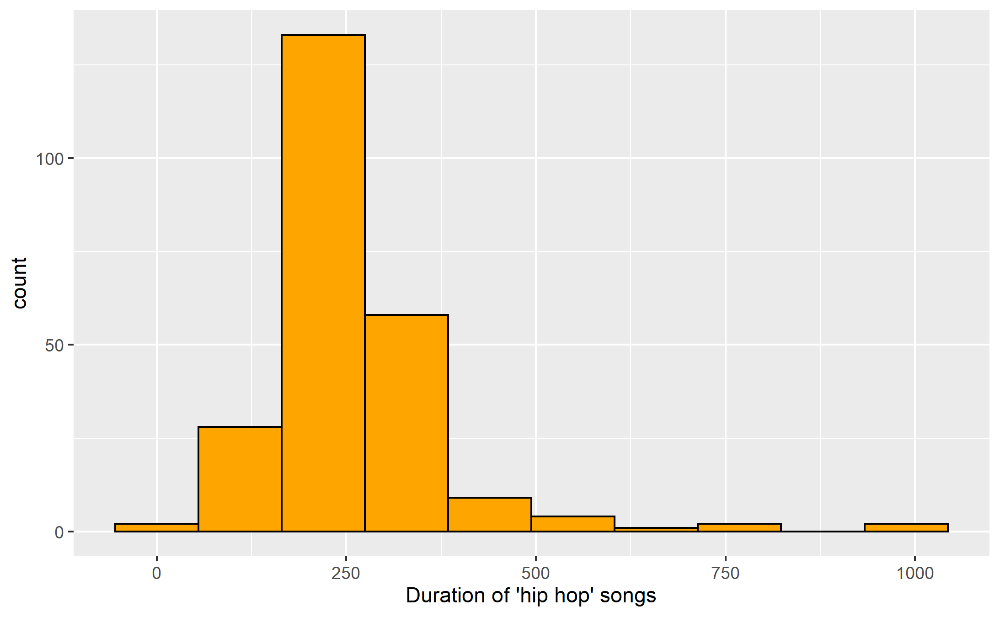
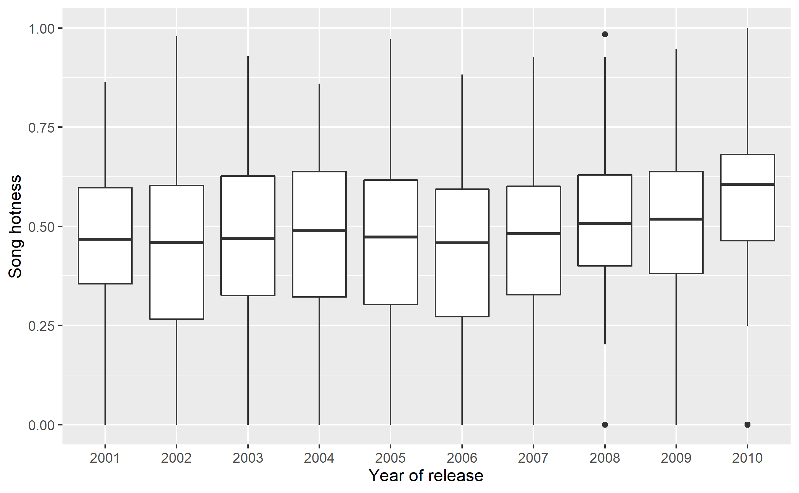
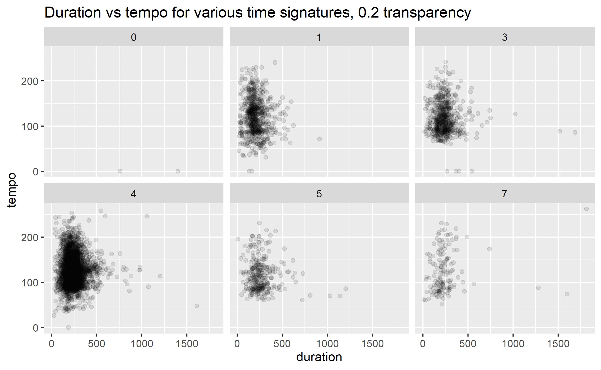

---
output:
  html_document: default
---

```{r setup, include = F}
knitr::opts_chunk$set(results = 'hold')
library(tidyverse)
```

******************

## OSNOVE STATISTIČKOG PROGRAMIRANJA
#### **Fakultet elektrotehnike i računarstva, Sveučilište u Zagrebu**
#### 26/01/2023

******************

# **ZAVRŠNI ISPIT**  

======================================================================================

#### JMBAG: 0246074767     
#### Ime i prezime: Kristo Palić
#### e-mail: kp024607476@fer.hr
#### IP adresa: 86.33.75.184


======================================================================================

#### OSNOVNE UPUTE

U nastavku slijedi niz zadataka za završni ispit. Rješenja zadatka mogu uključivati **upisivanje programskog koda** ili **čistog teksta** te **izvršavanje programskog koda**. Molimo da se pridržavate sljedećih naputaka:

- prije rješavanja stisnite gumb **Knit to HTML** kako bi provjerili ispravnost sučelja te dobili predložak ispita u preglednijem obliku u prozoru preglednika s desne strane
- ukoliko nije drugačije navedeno, prostor za rješavanje zadataka sami stvarate kombinacijom tipaka **CTRL+ALT+I** ili odabirom opcija **Insert -> R**
- pažljivo čitajte tekstove zadataka
- tekst zadatka može sadržavati i programski kod kojeg morate izmijeniti i nadopuniti te izvršiti već prema uputama danim u tekstu zadatka i / ili komentarima postojećeg programskog koda
- ukoliko je rješenje zadatka programski kod koji nešto ispisuje, budite sigurni da bilježnica uključuje i taj ispis
- programski kod slobodno komentirajte


Nakon ispunjavanja bilježnice odaberite opciju **Knit to HTML* i pohranite rezultat u HTML obliku u predviđeni repozitorij na *Moodle* stranicama predmeta. 

Tijekom rješavanja bilježnice smijete se koristiti pomoćnim sredstvima kao što su podsjetnici, dokumentacija jezika R, bilježnice s predavanja, *Google* tražilica. **Ne smijete razmjenjivati informacije sa drugim polaznicima ispita bilo kojim vidom komunikacije, uključujući i elektroničku poštu, društvene mreže, chat programe ili korištenje zajedničkog dijeljenog repozitorija!**

Pohranom HTML bilježnice pod Vašim korisničkim imenom i lozinkom garantirate da tijekom ove provjere znanje niste od drugoga primili niti pružili pomoć te da se niste koristili nedopuštenim sredstvima. Ove su radnje povreda Kodeksa ponašanja te mogu uzrokovati trajno isključenje s Fakulteta.

Prije rješavanja zadataka postavite datoteku `music.csv` u mapu gdje se nalazi ova bilježnica i učitajte podatke iz nje uz pomoć sljedeće naredbe:

```{r}
rm(list = ls())    # brišemo postojeće varijable kako bi krenuli od nule
# učitavanje podataka iz datoteke `music.csv`
music <- read.csv("./music.csv")
head(music)
str(music)
# termini koje ćemo koristiti za neke od atributa
# `duration` - trajanje
# `artist.name` - naziv umjetnika
# `release.name` - naziv albuma
# `song.title` - naziv pjesme
# `song.hotness` - popularnost pjesme

# (opcionalno) head, glimpse, summary
# rezultate eksploratorne analize NE UKLJUČUJETE U INAČICU ZA PREDAJU
```

Učitane podatke možete vidjeti u prozoru s gornje desne strane sučelja **RStudio**, tab *Environment**.

======================================================================================

## ZADACI

******************

**NAPOMENA** U zadacima nije dopušteno koristiti eksplicitne programske petlje!

******************

## 1. ZADATAK (8 bodova)

Za podatke iz podatkovnog okvira ispišite sljedeće:

**(2 boda)**

a) Za prvih 10 pjesama čiji je naziv kraći od 8 znakova ispišite naziv umjetnika i naziv pjesme.

**RJEŠENJE:**

```{r}
a <- music[length(music$song.title) < 8, c("artist.name", "song.title")]
a
```

***

**(2 boda)**
b) Za sve pjesme čiji naziv sadrži niz slova "cool" ili "hot" (neovisno o veličini slova) a koje imaju poznatu godinu izlaska ispišite naziv umjetnika, naziv pjesme, godinu izdavanja i popularnost. Ispis poredajte po godini izdavanja uzlazno.

**RJEŠENJE:**

```{r}
hot <- grep("hot", music$song.title, ignore.case = T)
cool <- grep("cool", music$song.title, ignore.case = T)
together <- c(hot, cool)

b <- music[together,]
b <- b[is.na(b$year) == FALSE,]
b <- b[b$year > 0,]
b <- b[order(b$year), c("artist.name", "song.title", "year", "song.hotness")]
b
```

***

**(2 boda)**
c) Za nasumičnih 10 pjesama iz žanra `"blues-rock"` ispišite naziv umjetnika, naziv albuma, naziv pjesme i trajanje u minutama i sekundama (npr. 193 = "3m 13s")

```{r}
c <- music[music$genre == "blues-rock", "genre"]
vek <- sample((1:length(c)), 10)

dur = 200
cat(dur %/% 60, "min", dur %% 60, "sek")


cmusic <- music
#cmusic$duration <- toString(cmusic$duration %/% 60, " min ", cmusic$duration %% 60, " sek", width = 20)
cmusic[vek, c("artist.name", "release.name", "song.title", "duration")]
```


**RJEŠENJE:**

```{r}
set.seed(1281)


```

***

**(2 boda)**
d) Ispišite prosječno trajanje i popularnost pjesama izdanih u '80-tima, za svaku godinu iz tog perioda. 


**RJEŠENJE:**

```{r}
start <- 1980
for (i in (1:9)) {
  godina <- start + i
  print(godina)
  print(mean(music[music$year == godina, "duration"]))
}
```


          
******************


## 2. ZADATAK (6 bodova)

Datoteke `graph1.png`, `graph2.png` i `graph3.png` sadrže tri vizualizacije podataka iz okvira `music` (ili nekog njegovog podskupa). Pokušajte rekonstruirati ove vizualicije.

**(2 boda)**
a) `graph1.png`

**RJEŠENJE:**

```{r}


ggplot() + geom_histogram(aes(x = music$duration), fill = "orange", bins = 10, binwidth = 100, )

```


***

**(2 boda)**
b) `graph2.png`

**RJEŠENJE:**

```{r}

dataFor3b <- music[music$year >= 2000 & music$year <= 2010,]
dataFor3b <- group_by(dataFor3b, year)
dataFor3b
ggplot() + geom_boxplot(aes(x = dataFor3b$year))

```

***


**(2 boda)**
c) `graph3.png`

**RJEŠENJE:**

```{r}



```


********************

## 3. ZADATAK (6 bodova)

Rezultate ovog zadatka ispišite u obliku postotka zaokruženog na dvije decimale, npr. `36.25%`.


**(2 boda)**
a) Ako pretpostavimo da se težine mačaka ravnaju po normalnoj razdiobi sa sredinom od 5 kg i standardnom devijacijom 1.5 kg, koja je vjerojatnost da će nasumično odabrana mačka imati između 6 i 7 kg?


**RJEŠENJE:**

```{r}

pnorm(7, 5, 1.5) - pnorm(6, 5, 1.5)
```

**(4 boda)**
b) Procijenite vjerojatnost da kod bacanja 5 kockica dobijete "full house" (kockice prikazuju jedan broj tri puta i drugi broj 2 puta). Procjena mora biti izvedena na temelju simulacije 10,000 eksperimenata.

```{r}

# 1 broj na 3 kocke = 1 * 1/6 * 1/6
# 2 broj na 2 kocke = 5/6 * 1/6

p = (1/6) * (1/6) * (5/6) * (1/6)
p
#
#
#baci5kocka <- function(n) {
#
#  a <- sample(1:6, 5)
#  a
#    prviBroj <- a[0] 
#    a[prviBroj] 
#    prviBrojac <- 
#    drugiBrojac <-     
#  for (i in (1:5)) {
#    nadi je li full house ili ne
#  }
#    ako je vrati 1 inace 0
#
#    
#mean(replicate(baci5kocka(), 100000))
#      
#}

```


### Rješenje

```{r}
set.seed(1232)

```


******************

## 4. ZADATAK (5 bodova)

Izvršite sljedeći odsječak koji rastavlja podatkovni okvir `music` na dva podokvira.


```{r}
set.seed(1233)

train_ind <- sample(1:nrow(music), round(0.7 * nrow(music)))
music.train <- music[train_ind, ]
music.test <- music[-train_ind, ]

```

**(2 boda)**
a)  Korištenjem skupa `music.train` istrenirajte model linearne regresije koji će probati pogoditi *popularnost pjesme* na osnovu trajanja pjesme, tempa i popularnosti umjetnika. Ispišite sažetak modela. Prema dobivenim rezultatima, koju varijablu smatrate najboljim, a koju najlošijim prediktorom popularnosti pjesme? 

**RJEŠENJE:**

```{r}
regresija <- lm(music.train$song.hotness ~ music.train$duration + music.train$tempo + music.train$artist.hotness)
summary(regresija)

```

*KOMENTAR REZULTATA:*


******************************************************


**(3 boda)**
b)  Uz pomoć metode `predict` i linearnog modela iz a) zadatka stvorite predikcije korištenjem opservacija iz skupa `music.test` a potom izračunajte reziduale. Provjerite i komentirajte normalnost dobivenih reziduala. 

**RJEŠENJE:**

```{r}

b <- predict(regresija, music.test)
head(b)
```

*KOMENTAR REZULTATA:*


