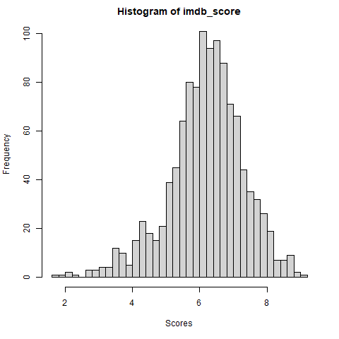
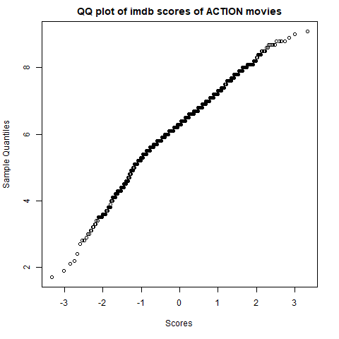
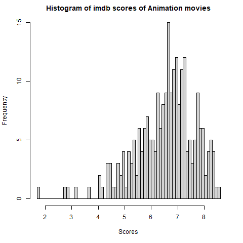
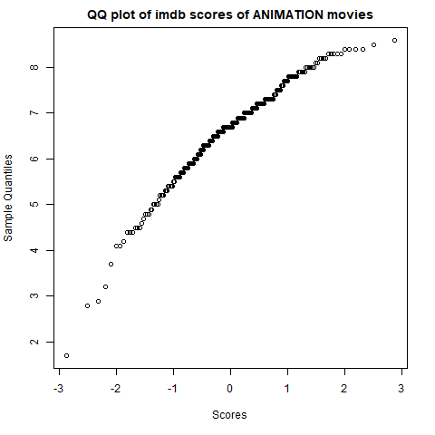
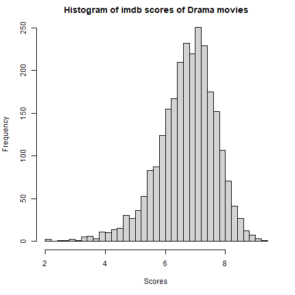
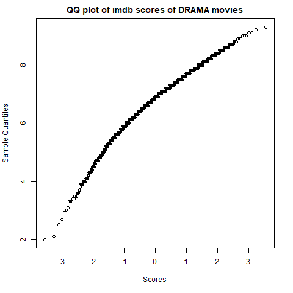
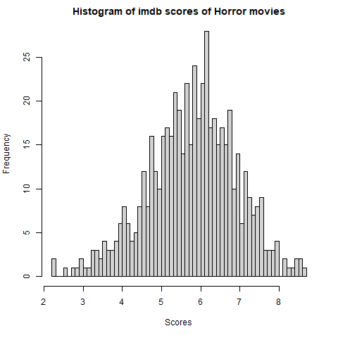
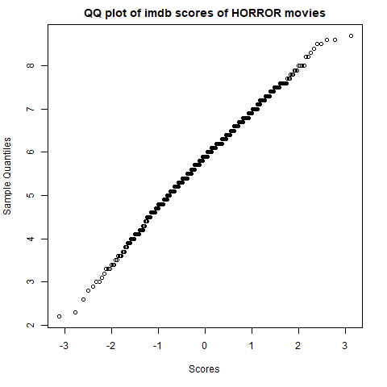
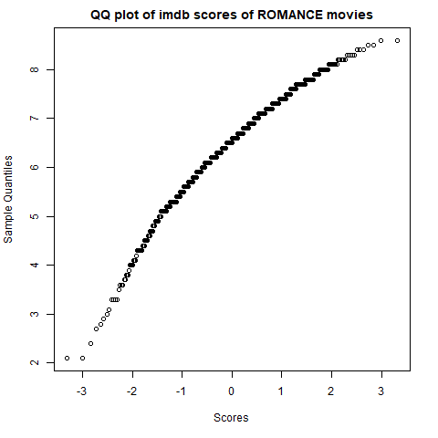
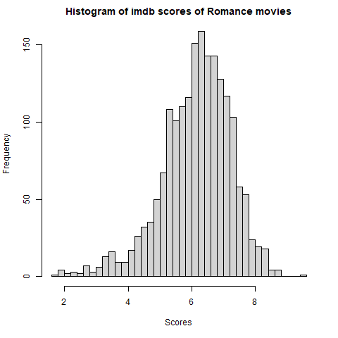

```{r echo=FALSE}

#UCITAVANJE BIBLIOTEKA

library(dplyr)
library(ggplot2)
library(tidyverse)
library(stats)
library(car)

source("../R/custom.R")
load("data.RData")
```
\newpage

# 1. Imaju li neki žanrovi značajno različite ocjene na IMDB-u?
\
Promatrat ćemo sljedeće žanrove: 
  
  Action, Comedy, Drama, Romance, Thriller, Horror, Western, 
  Animation, History i Documentary
```{r}
genresSplit = unlist(strsplit(data$genres, "\\|"))
print(table(genresSplit), width = 80)
```
\
\
Dijelimo žanrove pojedinih filmova svaki u svoj redak radi lakšeg upravljanja podatcima. Podatke imamo spremljene u varijabli modifiedDataForFirst

```{r}
action <- subset(modifiedDataForFirst, genres == "Action")
save(action, file = "data.RData")

comedy <- subset(modifiedDataForFirst, genres == "Comedy")
save(comedy, file = "data.RData")

drama <- subset(modifiedDataForFirst, genres == "Drama")
save(drama, file = "data.RData")

romance <- subset(modifiedDataForFirst, genres == "Romance")
save(romance, file = "data.RData")

thriller <- subset(modifiedDataForFirst, genres == "Thriller")
save(thriller, file = "data.RData")

horror <- subset(modifiedDataForFirst, genres == "Horror")
save(horror, file = "data.RData")

animation <- subset(modifiedDataForFirst, genres == "Animation")
save(animation, file = "data.RData")
```

\newpage
## ANOVA
ANOVA (ANalysis Of VAriance) je metoda kojom testiramo sredine više populacija. U analizi varijance
pretpostavlja se da je ukupna varijabilnost u podatcima posljedica varijabilnosti podataka unutar svakog
pojedine grupe (populacije) i varijabilnosti između različitih grupa. Varijabilnost unutar pojedinog uzorka je
rezultat slučajnosti, a ukoliko postoje razlike u srednimana populacija, one će biti odražene u varijabilnosti
među grupama. 
Jedan od glavnih ciljeva analize varijance je ustanoviti jesu li upravo te razlike između grupa
samo posljedica slučajnosti ili je statistički značajna.


Pretpostavke ANOVA-e su:
\newline
1.) nezavisnost pojedinih podataka u uzorcima
\newline
2.) normalna razdioba podataka
\newline
3.) homogenost varijanci među populacijama.

Provjeru normalnosti podataka radit cemo preko histograma i qqplota.
\newpage
```{r, echo=FALSE}
# ACTION



```
\
```{r, echo=FALSE}
# ANIMATION


```
\
```{r, echo=FALSE}
# DRAMA


```
\
```{r, echo=FALSE}
# HORROR


```
\
```{r, echo=FALSE}
# ROMANCE
knitr::include_graphics("../figures/report/romanceHistogram.png")

```
\
```{r, echo=FALSE}
# ANIMATION


```
\newpage

Testiranje homogenosti varijance uzoraka radili bi Bartletovim testom kad bi imali uzorke jednakih veličina. Umjesto njega, koristit ćemo Levenov test koji ne pretpostavlja jednaku veličinu uzoraka. 


```{r, p}

leveneTest(y = c(action$imdb_score, comedy$imdb_score, 
                 drama$imdb_score, romance$imdb_score,
                 thriller$imdb_score, horror$imdb_score, 
                 animation$imdb_score),
           group = factor(c(rep("action", length(action$imdb_score)),
                            rep("drama", length(drama$imdb_score)),
                            rep("comedy", length(comedy$imdb_score)),
                            rep("thriller", length(thriller$imdb_score)),
                            rep("animation", length(animation$imdb_score)),
                            rep("romance", length(romance$imdb_score)),
                            rep("horror", length(horror$imdb_score)))),
           center = mean)
```
Ne možemo koristiti ANOVU jer pretpostavka jednakosti varijanci nije zadovoljena. Normalnost distribucija bi mogli provjeriti neparametarskim testovima poput Kolmogorljev-Smirnovljevog testa i LillieForce inačice. Međutim zbog nejednakosti varijanci moramo koristiti neparametarski Kruskal-Wallis H test pa nam je normalnost nebitna i nećemo je dalje testirati. Kruskal-Wallis H test pretpostavlja da distribucije dolaze iz jednakih distribucija što vidimo iz qq-plotova

```{r}

kruskal.test(modifiedDataForFirst$imdb_score ~ modifiedDataForFirst$genres)

```
Užasno mala p-vrijednost sugerira da postoje značajne razlike u medijanima
između imdb_score-ova različitih žanrova, stoga odbacujemo H0 u korist H1.

Postoji značajna razlika u ocjenama filmova koji dolaze iz različitih žanrova.

